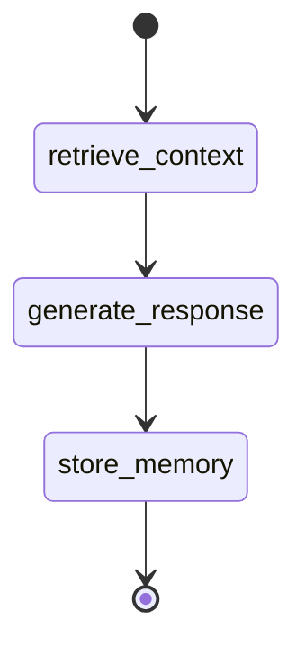

# CognitiveLoop

The main conversation orchestrator using LangGraph.

**Module:** `src.graph_loop`

## Class Definition

```python
class CognitiveLoop:
    """
    Orchestrates the conversation loop with memory retrieval,
    response generation, and entity extraction.

    Uses LangGraph to manage state across three nodes:
    1. retrieve_context - Semantic search for relevant memories
    2. generate_response - LLM response with context injection
    3. store_memory - Extract and persist new entities/relations
    """
```

## Constructor

```python
def __init__(self):
    """
    Initialize the cognitive loop.

    Creates:
    - MemoryGraph instance (backend from STORAGE_BACKEND)
    - LLM client (provider from LLM_PROVIDER)
    - ExtractionAgent for entity extraction
    - LangGraph state machine

    Environment Variables:
        LLM_PROVIDER: "openai" or "ollama"
        OPENAI_API_KEY: Required for OpenAI provider
        OLLAMA_BASE_URL: Ollama server URL
        OLLAMA_MODEL: Ollama model name
        STORAGE_BACKEND: "json" or "sqlite"

    Raises:
        ValueError: If required configuration is missing.
        ConnectionError: If LLM provider is unavailable.
    """
```

### Example

```python
from src.graph_loop import CognitiveLoop

# Initialize with environment configuration
loop = CognitiveLoop()
```

## Methods

### invoke

```python
def invoke(self, message: str) -> str:
    """
    Process a user message through the conversation loop.

    Steps:
    1. Retrieve relevant context from memory
    2. Generate LLM response with context
    3. Extract entities from conversation
    4. Store new entities and relations

    Args:
        message: User's input message.

    Returns:
        Assistant's response string.

    Raises:
        ValueError: If message is empty.
        RuntimeError: If LLM call fails.
    """
```

#### Example

```python
response = loop.invoke("Hi, I'm Alice and I work at Anthropic.")
print(response)
# "Nice to meet you, Alice! It's great to hear you're working at Anthropic..."
```

### get_context

```python
def get_context(self, message: str) -> str:
    """
    Retrieve relevant context without generating a response.

    Useful for debugging or custom response generation.

    Args:
        message: Query to search for.

    Returns:
        Formatted context string.
    """
```

#### Example

```python
context = loop.get_context("What do I do for work?")
print(context)
# "Relevant context from memory:
#  - Alice (Person): AI researcher at Anthropic
#  - Anthropic (Organization): AI safety company"
```

### extract_entities

```python
def extract_entities(self, message: str, response: str) -> EntityExtraction:
    """
    Extract entities from a conversation turn.

    Args:
        message: User's message.
        response: Assistant's response.

    Returns:
        EntityExtraction with entities and relations.
    """
```

#### Example

```python
extraction = loop.extract_entities(
    "I learned Python last year",
    "That's great! Python is very useful."
)
print(f"Entities: {[e.name for e in extraction.entities]}")
# ["Python"]
print(f"Relations: {[(r.source, r.relation, r.target) for r in extraction.relations]}")
# [("USER", "LEARNED", "Python")]
```

## Properties

### memory

```python
@property
def memory(self) -> MemoryGraph:
    """
    Access the underlying MemoryGraph instance.

    Returns:
        MemoryGraph for direct graph operations.
    """
```

#### Example

```python
# Access memory directly
stats = loop.memory.get_stats()
nodes = loop.memory.get_all_nodes()
```

### llm

```python
@property
def llm(self) -> BaseChatModel:
    """
    Access the LLM client.

    Returns:
        LangChain chat model (ChatOpenAI or ChatOllama).
    """
```

## State Schema

The internal state passed between LangGraph nodes:

```python
class ConversationState(TypedDict):
    """State schema for the conversation loop."""

    message: str           # User's input message
    context: str           # Retrieved context string
    response: str          # Generated assistant response
    entities: List[Dict]   # Extracted entities
    relations: List[Dict]  # Extracted relations
```

## Graph Structure



## Configuration

The loop respects these environment variables:

| Variable | Effect |
|----------|--------|
| `LLM_PROVIDER` | Selects OpenAI or Ollama |
| `RETRIEVAL_TOP_K` | Number of context items |
| `SIMILARITY_THRESHOLD` | Minimum similarity for retrieval |
| `DUPLICATE_THRESHOLD` | Deduplication sensitivity |

## Error Handling

```python
from src.graph_loop import CognitiveLoop

try:
    loop = CognitiveLoop()
except ValueError as e:
    # Missing OPENAI_API_KEY or invalid config
    print(f"Config error: {e}")

try:
    response = loop.invoke("Hello")
except RuntimeError as e:
    # LLM API error
    print(f"LLM error: {e}")
except ConnectionError as e:
    # Ollama not running
    print(f"Connection error: {e}")
```

## Custom System Prompt

To customize the system prompt:

```python
# Modify src/graph_loop.py or subclass
class CustomLoop(CognitiveLoop):
    SYSTEM_PROMPT = """You are a helpful assistant with memory...

    Custom instructions here.
    """
```

## Thread Safety

`CognitiveLoop` is NOT thread-safe. Create separate instances per thread:

```python
# Wrong - shared instance
loop = CognitiveLoop()
# threads share loop - race conditions!

# Correct - instance per request
def handle_request(message: str) -> str:
    loop = CognitiveLoop()  # New instance
    return loop.invoke(message)
```

For async applications, see [API Overview](index.md#thread-safety).

## Full Example

```python
from src.graph_loop import CognitiveLoop

# Initialize
loop = CognitiveLoop()

# Conversation
messages = [
    "Hi! I'm Alice and I work at Anthropic on AI safety.",
    "I specialize in RLHF and live in San Francisco.",
    "What do you know about me?"
]

for message in messages:
    print(f"User: {message}")
    response = loop.invoke(message)
    print(f"Assistant: {response}\n")

# Check what was stored
stats = loop.memory.get_stats()
print(f"\nMemory: {stats['nodes']} nodes, {stats['edges']} edges")

# List all entities
for node in loop.memory.get_all_nodes():
    print(f"- {node.name} ({node.label})")
```

## See Also

- [MemoryGraph](memory-graph.md)
- [Architecture Overview](../architecture/overview.md)
- [Configuration](../getting-started/configuration.md)
