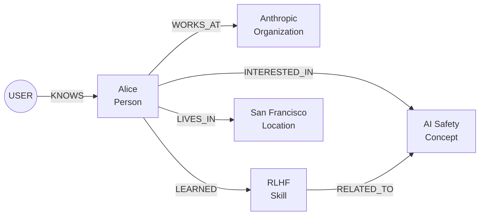

# Knowledge Graph Schema

CognitiveOS stores knowledge as a directed graph with typed entities (nodes) and relationships (edges).

## Entity Types

| Type | Description | Examples |
|------|-------------|----------|
| **Person** | Named individuals | "Alice", "Dr. Smith", "John" |
| **Concept** | Abstract ideas or topics | "machine learning", "sustainability", "philosophy" |
| **Preference** | User likes/dislikes | "likes hiking", "prefers Python", "dislikes meetings" |
| **Skill** | Abilities or competencies | "Python programming", "public speaking", "data analysis" |
| **Location** | Physical or virtual places | "San Francisco", "MIT", "home office" |
| **Event** | Timestamped occurrences | "NeurIPS 2024", "graduation", "project launch" |
| **Organization** | Companies, groups, institutions | "Anthropic", "MIT", "Python Software Foundation" |

## Relation Types

| Relation | Description | Example |
|----------|-------------|---------|
| **KNOWS** | Personal connection | Alice KNOWS Bob |
| **WORKS_AT** | Employment | Alice WORKS_AT Anthropic |
| **LIVES_IN** | Residence | Alice LIVES_IN San Francisco |
| **LIKES** | Positive preference | Alice LIKES hiking |
| **DISLIKES** | Negative preference | Alice DISLIKES meetings |
| **LEARNED** | Skill acquisition | Alice LEARNED Python |
| **INTERESTED_IN** | Topic interest | Alice INTERESTED_IN AI safety |
| **ATTENDED** | Event participation | Bob ATTENDED NeurIPS |
| **BELONGS_TO** | Membership | Alice BELONGS_TO ACM |
| **CREATED** | Creation/authorship | Alice CREATED the report |
| **RELATED_TO** | General relationship | RLHF RELATED_TO AI safety |

## Node Schema

```python
class Node(BaseModel):
    """A node in the memory graph representing an entity."""

    id: str                           # UUID v4
    label: str                        # Entity type (Person, Concept, etc.)
    name: str                         # Display name
    description: Optional[str]        # Human-readable description
    embedding: Optional[List[float]]  # 384-dim vector (all-MiniLM-L6-v2)
    metadata: NodeMetadata            # Timestamps, importance, access count

    # Soft-delete fields (Phase 3)
    deleted_at: Optional[datetime]    # When node was soft-deleted
    merged_into_id: Optional[str]     # If merged, points to primary node

class NodeMetadata(BaseModel):
    created_at: datetime
    updated_at: datetime
    importance: float = 0.5           # 0.0 to 1.0
    access_count: int = 0             # How often retrieved
```

## Edge Schema

```python
class Edge(BaseModel):
    """An edge in the memory graph representing a relationship."""

    id: str                           # UUID v4
    source: str                       # Source node ID
    target: str                       # Target node ID
    relation: str                     # Relation type (KNOWS, WORKS_AT, etc.)
    description: Optional[str]        # Context about the relationship
    metadata: EdgeMetadata

class EdgeMetadata(BaseModel):
    created_at: datetime
    confidence: float = 1.0           # Extraction confidence
```

## Example Graph



## Entity Disambiguation

When extracting entities, the system checks for duplicates:

1. **Name similarity** - Exact match or fuzzy matching
2. **Embedding similarity** - Cosine similarity > `DUPLICATE_THRESHOLD`
3. **Type match** - Same entity type

**Example:** If "Python" (Skill) exists and user mentions "Python programming", the system will link to the existing entity rather than creating a duplicate.

## Special Entities

### USER Entity

Every graph includes a special `USER` entity representing the conversation participant:

```json
{
  "id": "user",
  "label": "Person",
  "name": "USER",
  "description": "The user of this CognitiveOS instance"
}
```

All personal facts are connected to this entity.

## Importance Scoring

Entity importance is calculated based on:

| Factor | Weight | Description |
|--------|--------|-------------|
| **Access count** | 0.3 | How often entity is retrieved |
| **Connection count** | 0.3 | Number of relationships |
| **Recency** | 0.2 | Time since last update |
| **Explicit** | 0.2 | User-stated importance |

Importance affects:
- Retrieval ranking (higher importance = higher priority)
- Consolidation pruning (low importance entities may be pruned)

## Storage Representation

### JSON Format

```json
{
  "nodes": {
    "alice_123": {
      "id": "alice_123",
      "label": "Person",
      "name": "Alice",
      "description": "AI researcher at Anthropic",
      "embedding": [0.123, -0.456, ...],
      "metadata": {
        "created_at": "2025-01-15T10:30:00Z",
        "updated_at": "2025-01-15T10:30:00Z",
        "importance": 0.8,
        "access_count": 5
      }
    }
  },
  "edges": [
    {
      "id": "edge_789",
      "source": "user",
      "target": "alice_123",
      "relation": "KNOWS",
      "metadata": {
        "created_at": "2025-01-15T10:30:00Z",
        "confidence": 1.0
      }
    }
  ]
}
```

### SQLite Schema

```sql
CREATE TABLE nodes (
    id TEXT PRIMARY KEY,
    label TEXT NOT NULL,
    name TEXT NOT NULL,
    description TEXT,
    embedding BLOB,  -- sqlite-vec vector
    importance REAL DEFAULT 0.5,
    access_count INTEGER DEFAULT 0,
    created_at TEXT NOT NULL,
    updated_at TEXT NOT NULL,
    deleted_at TEXT DEFAULT NULL,
    merged_into_id TEXT DEFAULT NULL
);

CREATE TABLE edges (
    id TEXT PRIMARY KEY,
    source TEXT NOT NULL REFERENCES nodes(id),
    target TEXT NOT NULL REFERENCES nodes(id),
    relation TEXT NOT NULL,
    description TEXT,
    confidence REAL DEFAULT 1.0,
    created_at TEXT NOT NULL
);

CREATE TABLE audit_log (
    id INTEGER PRIMARY KEY AUTOINCREMENT,
    timestamp TEXT NOT NULL,
    operation TEXT NOT NULL,
    entity_type TEXT NOT NULL,
    entity_id TEXT NOT NULL,
    entity_name TEXT,
    changes TEXT,  -- JSON
    reason TEXT
);
```

## Best Practices

### Entity Naming

- Use proper capitalization: "Alice", "San Francisco"
- Be specific: "Python programming" vs just "Python"
- Include context in description

### Relation Selection

- Use the most specific relation type
- KNOWS for people, INTERESTED_IN for topics
- RELATED_TO as fallback for general connections

### Graph Maintenance

- Run consolidation periodically to merge duplicates
- Monitor importance scores for pruning candidates
- Review audit log for unexpected changes

## See Also

- [Retrieval Algorithm](retrieval.md)
- [Storage Backends](storage.md)
- [Consolidation Guide](../user-guide/consolidation.md)
