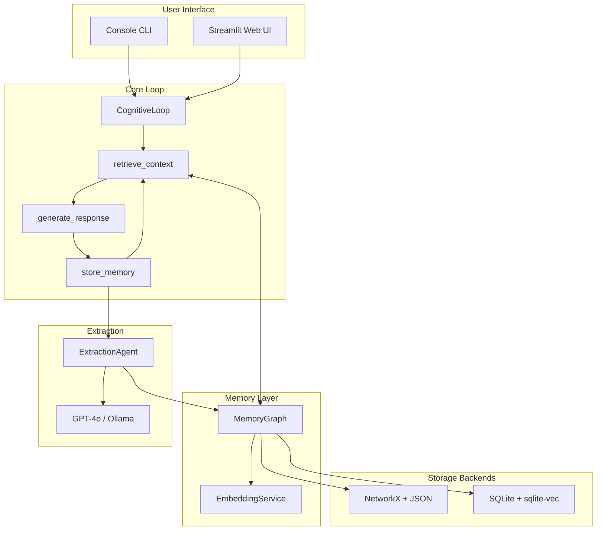

# Architecture Overview

CognitiveOS is built as a **LangGraph-orchestrated memory system** that extracts, stores, and retrieves knowledge from conversations.

## System Architecture



## Core Flow

The conversation loop follows three main steps:

### 1. Context Retrieval (`retrieve_context`)

```mermaid
sequenceDiagram
    participant User
    participant Loop as CognitiveLoop
    participant MG as MemoryGraph
    participant ES as EmbeddingService

    User->>Loop: Message
    Loop->>ES: Embed message
    ES-->>Loop: Vector (384-dim)
    Loop->>MG: Search similar entities
    MG-->>Loop: Top-K entities
    Loop->>Loop: Format context string
```

**Process:**
1. User message is converted to embedding vector
2. Cosine similarity computed against all entity embeddings
3. Top-K most similar entities retrieved (configurable via `RETRIEVAL_TOP_K`)
4. Entities above similarity threshold included (configurable via `SIMILARITY_THRESHOLD`)
5. Context formatted as structured text for LLM

### 2. Response Generation (`generate_response`)

```mermaid
sequenceDiagram
    participant Loop as CognitiveLoop
    participant LLM as GPT-4o/Ollama

    Loop->>LLM: System prompt + Context + User message
    LLM-->>Loop: Assistant response
```

**Prompt Structure:**
```
System: You are a helpful assistant with access to a personal knowledge graph...

Context from memory:
- Alice (Person): Works at Anthropic on AI safety
- Anthropic (Organization): AI research company
- RLHF (Concept): Reinforcement Learning from Human Feedback

User: What do you know about my work?
```

### 3. Memory Storage (`store_memory`)

```mermaid
sequenceDiagram
    participant Loop as CognitiveLoop
    participant EA as ExtractionAgent
    participant LLM as GPT-4o/Ollama
    participant MG as MemoryGraph
    participant ES as EmbeddingService

    Loop->>EA: User message + Assistant response
    EA->>LLM: Extract entities (structured output)
    LLM-->>EA: Entities + Relations
    EA->>ES: Generate embeddings
    ES-->>EA: Vectors
    EA->>MG: Store nodes and edges
    EA->>MG: Deduplicate (similarity check)
```

**Extraction uses Pydantic structured output:**
```python
class EntityExtraction(BaseModel):
    entities: List[ExtractedEntity]
    relations: List[ExtractedRelation]
```

## Component Details

### CognitiveLoop

**Location:** `src/graph_loop.py`

The main orchestrator using LangGraph's `StateGraph`:

```python
class CognitiveLoop:
    def __init__(self):
        self.memory = MemoryGraph()
        self.llm = create_llm()
        self.extractor = ExtractionAgent(self.llm, self.memory)
        self.graph = self._build_graph()

    def _build_graph(self) -> CompiledGraph:
        builder = StateGraph(ConversationState)
        builder.add_node("retrieve_context", self.retrieve_context)
        builder.add_node("generate_response", self.generate_response)
        builder.add_node("store_memory", self.store_memory)

        builder.add_edge(START, "retrieve_context")
        builder.add_edge("retrieve_context", "generate_response")
        builder.add_edge("generate_response", "store_memory")
        builder.add_edge("store_memory", END)

        return builder.compile()
```

### MemoryGraph

**Location:** `src/memory/graph.py`

Abstract interface for knowledge graph operations:

```python
class MemoryGraph:
    def add_node(self, node: Node) -> None
    def add_edge(self, edge: Edge) -> None
    def get_node(self, node_id: str) -> Optional[Node]
    def search_similar(self, query_embedding: List[float], top_k: int) -> List[Node]
    def get_all_nodes(self) -> List[Node]
    def get_stats(self) -> Dict[str, int]
```

Supports two backends:
- **JSON**: NetworkX graph serialized to JSON file
- **SQLite**: SQLite database with sqlite-vec for vector search

### ExtractionAgent

**Location:** `src/agents/extractor.py`

Uses GPT-4o with structured output to extract entities:

```python
class ExtractionAgent:
    def extract(self, message: str, response: str) -> EntityExtraction:
        prompt = EXTRACTION_PROMPT.format(
            message=message,
            response=response
        )
        return self.llm.with_structured_output(
            EntityExtraction,
            method="function_calling"
        ).invoke(prompt)
```

### EmbeddingService

**Location:** `src/memory/embeddings.py`

Singleton service for text embeddings:

```python
class EmbeddingService:
    _instance = None
    _model = None

    @classmethod
    def get_instance(cls):
        if cls._instance is None:
            cls._instance = cls()
            cls._model = SentenceTransformer('all-MiniLM-L6-v2')
        return cls._instance

    def embed(self, text: str) -> List[float]:
        return self._model.encode(text).tolist()
```

**Model:** `all-MiniLM-L6-v2` (384 dimensions, ~90MB)

### ConsolidationEngine

**Location:** `src/consolidation/engine.py`

Optimizes the memory graph by:
1. **Merging duplicates** - Entities with similarity > threshold
2. **Pruning stale data** - Inactive entities with low importance
3. **Soft delete** - Preserves history with `deleted_at` timestamps

## Data Flow Example

**User says:** "I'm learning Python for machine learning"

1. **Retrieval:** Search for similar context (may find existing "Python" or "machine learning" entities)

2. **Generation:** LLM responds with retrieved context

3. **Extraction:** LLM extracts:
   - Entity: "Python" (Skill)
   - Entity: "machine learning" (Concept)
   - Relation: USER → LEARNED → Python
   - Relation: USER → INTERESTED_IN → machine learning

4. **Storage:**
   - Check for existing "Python" entity (deduplication)
   - Generate embeddings for new entities
   - Store nodes and edges
   - Update timestamps

## Storage Architecture

### JSON Backend

```
data/memory.json
├── nodes: { id → Node }
├── edges: [ Edge, ... ]
└── metadata: { version, created_at }
```

**Pros:** Simple, portable, human-readable
**Cons:** No vector search optimization, loads entire graph to memory

### SQLite Backend

```
data/memory.db
├── nodes (id, label, name, embedding, metadata, deleted_at, ...)
├── edges (source, target, relation, ...)
├── audit_log (timestamp, operation, entity_id, ...)
└── schema_version
```

**Pros:** Vector search via sqlite-vec, ACID transactions, soft delete, audit log
**Cons:** Requires sqlite-vec extension

## Phase Evolution

| Phase | Features |
|-------|----------|
| **Phase 1** | Console prototype, NetworkX + JSON |
| **Phase 2** | SQLite + sqlite-vec, Streamlit UI, PyVis |
| **Phase 3** | Memory consolidation, Ollama support, soft delete |
| **Phase 4** | Background consolidation, multi-user (planned) |

## See Also

- [Knowledge Graph Schema](knowledge-graph.md)
- [Retrieval Algorithm](retrieval.md)
- [Storage Backends](storage.md)
- [API Reference](../api/index.md)
