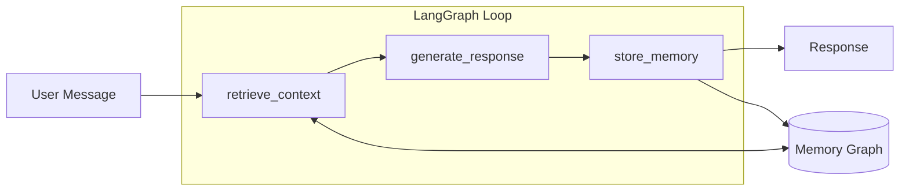

# CognitiveOS

**Local-first memory system for LLMs** - Extract entities and relations from conversations, store them in a knowledge graph, and retrieve relevant context for personalized responses.

## Features

- **Entity Extraction** - Automatically extract people, concepts, events, skills, and preferences from conversations
- **Knowledge Graph** - Store relationships in a queryable graph structure with NetworkX or SQLite
- **Semantic Search** - Find relevant memories using embedding similarity (all-MiniLM-L6-v2)
- **Multiple Backends** - JSON for simplicity, SQLite + sqlite-vec for performance
- **Local LLM Support** - Use Ollama for complete privacy (llama3.2, mistral, etc.)
- **Memory Consolidation** - Merge duplicates and prune stale data automatically
- **Web Interface** - Streamlit UI with interactive PyVis graph visualization

## Quick Example

```python
from src.graph_loop import CognitiveLoop

# Initialize with OpenAI
loop = CognitiveLoop()

# Have a conversation - entities are automatically extracted
response = loop.invoke("Hi! I'm Alice and I work at Anthropic on AI safety.")
print(response)
# "Nice to meet you, Alice! It's great to hear you're working on AI safety at Anthropic..."

# Later, the system remembers
response = loop.invoke("What do you know about me?")
print(response)
# "I know you're Alice and you work at Anthropic, focusing on AI safety research..."
```

## Architecture



## Getting Started

<div class="grid cards" markdown>

-   :material-download: **Installation**

    ---

    Set up CognitiveOS on Windows, macOS, or Linux in 5 minutes

    [:octicons-arrow-right-24: Install now](getting-started/installation.md)

-   :material-rocket-launch: **Quick Start**

    ---

    Your first conversation with persistent memory

    [:octicons-arrow-right-24: Get started](getting-started/quickstart.md)

-   :material-cog: **Configuration**

    ---

    Customize storage, LLM provider, and retrieval settings

    [:octicons-arrow-right-24: Configure](getting-started/configuration.md)

-   :material-graph: **Architecture**

    ---

    Understand how CognitiveOS works under the hood

    [:octicons-arrow-right-24: Learn more](architecture/overview.md)

</div>

## Current Version

**v0.3.0** - Phase 3 complete with memory consolidation and Ollama support.

See the [Changelog](https://github.com/sifly/CognitiveOS/blob/master/CHANGELOG.md) for full release history.

## License

MIT License - see [LICENSE](https://github.com/sifly/CognitiveOS/blob/master/LICENSE) for details.
