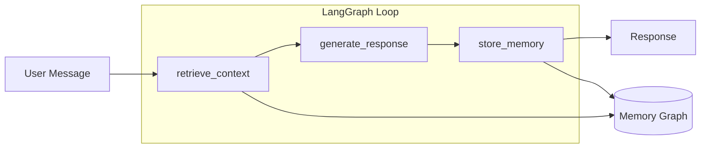
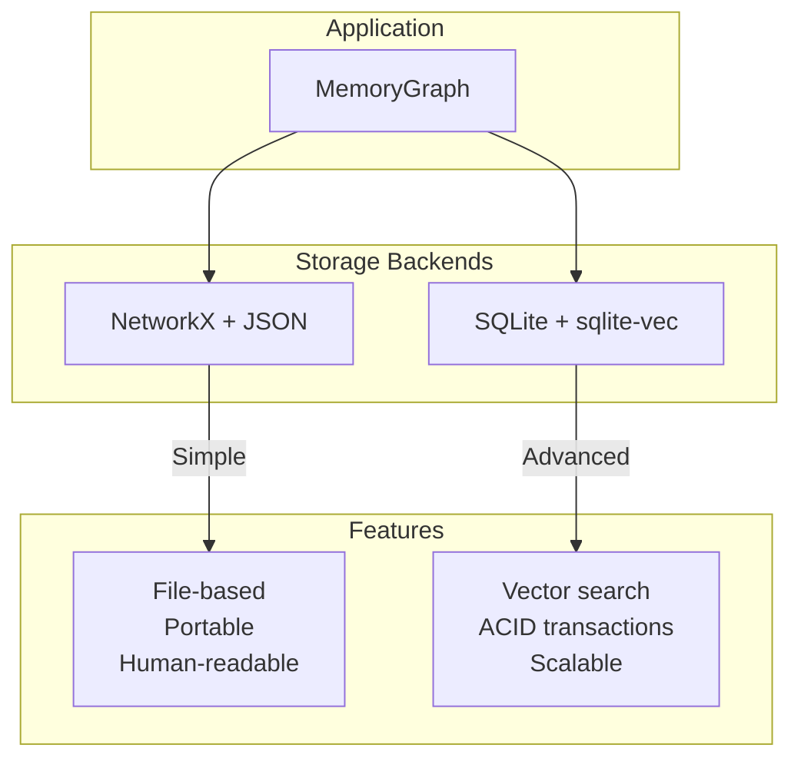

# docs: Comprehensive Documentation for CognitiveOS

**Status**: Draft
**Created**: 2025-12-08
**Type**: Documentation
**Priority**: High

## Overview

Create comprehensive documentation for CognitiveOS - a local-first memory system for LLMs. The documentation will follow the **Diataxis framework** (Tutorials, How-to Guides, Reference, Explanation) and be built with **MkDocs Material** for a professional, searchable documentation site.

## Problem Statement

### Current State
- **README.md** - Good overview but limited depth
- **CLAUDE.md** - Developer guidance for AI assistants
- **CHANGELOG.md** - Version history (well-maintained)
- **CognitiveOS-PRD.md** - Technical product requirements
- **docs/phase3-research.md** - Research documentation

### Gaps Identified
1. **No user guides** - New users lack step-by-step tutorials
2. **No API reference** - Developers can't discover or understand the API
3. **No architecture docs** - Design decisions not documented
4. **No troubleshooting guide** - Common issues undocumented
5. **No contributing guide** - Contributors lack onboarding
6. **Windows installation unclear** - sqlite-vec setup problematic
7. **Consolidation feature undiscoverable** - Phase 3 feature lacks usage docs

## Proposed Solution

### Documentation Structure

```
docs/
├── index.md                        # Landing page with overview
├── getting-started/
│   ├── installation.md             # Setup guide (Windows, macOS, Linux)
│   ├── quickstart.md               # 5-minute first conversation
│   └── configuration.md            # Environment variables reference
├── user-guide/
│   ├── cli-usage.md                # Console interface guide
│   ├── web-ui.md                   # Streamlit UI guide
│   ├── migration.md                # JSON to SQLite migration
│   ├── consolidation.md            # Memory optimization guide
│   └── local-llm.md                # Ollama setup guide
├── architecture/
│   ├── overview.md                 # System design & flow diagram
│   ├── knowledge-graph.md          # Entity/relation schema
│   ├── retrieval.md                # Semantic search algorithm
│   ├── storage.md                  # JSON vs SQLite backends
│   └── adr/                        # Architecture Decision Records
│       ├── 001-sqlite-storage.md
│       ├── 002-langgraph-orchestration.md
│       ├── 003-local-llm-support.md
│       └── 004-soft-delete-pattern.md
├── api/
│   ├── index.md                    # API overview
│   ├── memory-graph.md             # MemoryGraph class
│   ├── sqlite-store.md             # SQLiteMemoryStore class
│   ├── cognitive-loop.md           # CognitiveLoop class
│   ├── extraction-agent.md         # ExtractionAgent class
│   ├── consolidation-engine.md     # ConsolidationEngine class
│   └── models.md                   # Pydantic models (Node, Edge, etc.)
├── troubleshooting.md              # Common issues & solutions
├── contributing.md                 # Contribution guidelines
└── changelog.md                    # Link to CHANGELOG.md
```

### Supporting Files

```
mkdocs.yml                          # MkDocs configuration
CONTRIBUTING.md                     # Root-level contributing guide
docs/assets/
├── images/
│   ├── architecture-diagram.png
│   ├── graph-flow.png
│   └── streamlit-ui.png
└── css/
    └── custom.css                  # Theme customizations
```

## Implementation Phases

### Phase 1: Foundation (Priority: CRITICAL)

| Task | File | Description |
|------|------|-------------|
| MkDocs setup | `mkdocs.yml` | Configuration with Material theme |
| Landing page | `docs/index.md` | Overview with feature cards |
| Installation | `docs/getting-started/installation.md` | Windows/macOS/Linux setup |
| Quick start | `docs/getting-started/quickstart.md` | 5-minute tutorial |
| Configuration | `docs/getting-started/configuration.md` | All env vars documented |

### Phase 2: User Guides (Priority: HIGH)

| Task | File | Description |
|------|------|-------------|
| CLI usage | `docs/user-guide/cli-usage.md` | Console commands & features |
| Web UI | `docs/user-guide/web-ui.md` | Streamlit interface guide |
| Migration | `docs/user-guide/migration.md` | JSON to SQLite with backup |
| Consolidation | `docs/user-guide/consolidation.md` | Memory optimization |
| Local LLM | `docs/user-guide/local-llm.md` | Ollama setup & models |

### Phase 3: Architecture (Priority: HIGH)

| Task | File | Description |
|------|------|-------------|
| Overview | `docs/architecture/overview.md` | System design with diagrams |
| Knowledge graph | `docs/architecture/knowledge-graph.md` | Entity/relation schema |
| Retrieval | `docs/architecture/retrieval.md` | Semantic search algorithm |
| Storage | `docs/architecture/storage.md` | Backend comparison |
| ADRs | `docs/architecture/adr/*.md` | 4 decision records |

### Phase 4: API Reference (Priority: MEDIUM)

| Task | File | Description |
|------|------|-------------|
| API overview | `docs/api/index.md` | Public API surface |
| MemoryGraph | `docs/api/memory-graph.md` | Main interface docs |
| SQLiteStore | `docs/api/sqlite-store.md` | Database backend |
| CognitiveLoop | `docs/api/cognitive-loop.md` | LangGraph workflow |
| Models | `docs/api/models.md` | Pydantic schemas |

### Phase 5: Supporting Docs (Priority: MEDIUM)

| Task | File | Description |
|------|------|-------------|
| Troubleshooting | `docs/troubleshooting.md` | Common errors & fixes |
| Contributing | `CONTRIBUTING.md` | Contribution guidelines |
| CI/CD | `.github/workflows/docs.yml` | Auto-deploy to GitHub Pages |

## Key Content Specifications

### Entity Types Reference

| Type | Description | Example |
|------|-------------|---------|
| Person | Named individuals | "Alice", "Dr. Smith" |
| Concept | Abstract ideas | "machine learning", "sustainability" |
| Preference | User tastes | "likes hiking", "prefers Python" |
| Skill | Abilities | "Python programming", "public speaking" |
| Location | Places | "San Francisco", "home office" |
| Event | Occurrences | "NeurIPS 2024", "graduation" |
| Organization | Companies/groups | "Anthropic", "MIT" |

### Relation Types Reference

| Relation | Description | Example |
|----------|-------------|---------|
| KNOWS | Personal connection | Alice KNOWS Bob |
| WORKS_AT | Employment | Alice WORKS_AT Anthropic |
| LIVES_IN | Residence | Alice LIVES_IN San Francisco |
| LIKES | Positive preference | Alice LIKES hiking |
| LEARNED | Skill acquisition | Alice LEARNED Python |
| ATTENDED | Event participation | Bob ATTENDED NeurIPS |

### Configuration Reference

| Variable | Type | Default | Description |
|----------|------|---------|-------------|
| `OPENAI_API_KEY` | string | required | OpenAI API key |
| `LLM_PROVIDER` | string | `openai` | `openai` or `ollama` |
| `OLLAMA_BASE_URL` | string | `http://localhost:11434` | Ollama server URL |
| `OLLAMA_MODEL` | string | `llama3.2` | Ollama model name |
| `STORAGE_BACKEND` | string | `json` | `json` or `sqlite` |
| `MEMORY_FILE` | string | `data/memory.json` | JSON storage path |
| `DATABASE_PATH` | string | `data/memory.db` | SQLite storage path |
| `RETRIEVAL_TOP_K` | int | `10` | Number of context items |
| `SIMILARITY_THRESHOLD` | float | `0.7` | Minimum similarity |
| `DUPLICATE_THRESHOLD` | float | `0.85` | Deduplication threshold |
| `LOG_LEVEL` | string | `INFO` | Logging verbosity |

## Architecture Diagrams

### System Flow (Mermaid)



### Storage Architecture (Mermaid)



## Acceptance Criteria

### Functional Requirements

- [ ] Documentation site builds without errors (`mkdocs build --strict`)
- [ ] All internal links resolve correctly
- [ ] Code examples are tested and working
- [ ] Search functionality works
- [ ] Dark/light mode toggle works

### Content Requirements

- [ ] Installation works on Windows, macOS, Linux
- [ ] Quick start completes in under 5 minutes
- [ ] All configuration options documented
- [ ] All public API methods documented
- [ ] Architecture diagrams render correctly
- [ ] Troubleshooting covers top 10 common issues

### Quality Requirements

- [ ] No spelling/grammar errors
- [ ] Consistent formatting and style
- [ ] Code examples follow project conventions
- [ ] Screenshots are current and accurate

## Dependencies

### Documentation Dependencies

```
# Add to requirements.txt or docs-requirements.txt
mkdocs>=1.6.0
mkdocs-material>=9.5.0
mkdocstrings[python]>=0.24.0
pymdown-extensions>=10.0
```

### CI/CD Setup

**.github/workflows/docs.yml**
```yaml
name: Deploy Documentation

on:
  push:
    branches: [master]
    paths:
      - 'docs/**'
      - 'mkdocs.yml'
  workflow_dispatch:

permissions:
  contents: read
  pages: write
  id-token: write

jobs:
  deploy:
    runs-on: ubuntu-latest
    steps:
      - uses: actions/checkout@v4
      - uses: actions/setup-python@v5
        with:
          python-version: '3.11'
      - run: pip install mkdocs-material mkdocstrings[python]
      - run: mkdocs gh-deploy --force
```

## Testing Plan

### Manual Testing

1. **Fresh install test**: Follow installation guide on clean system
2. **Quick start test**: Complete tutorial in under 5 minutes
3. **Cross-platform**: Test on Windows, macOS, Linux
4. **Link validation**: Check all internal/external links
5. **Code examples**: Run all code snippets

### Automated Testing

```bash
# Build test
mkdocs build --strict

# Link checker
pip install linkchecker
linkchecker site/

# Spell check
pip install codespell
codespell docs/
```

## File List Summary

### New Files to Create

```
mkdocs.yml
CONTRIBUTING.md
docs/
├── index.md
├── getting-started/
│   ├── installation.md
│   ├── quickstart.md
│   └── configuration.md
├── user-guide/
│   ├── cli-usage.md
│   ├── web-ui.md
│   ├── migration.md
│   ├── consolidation.md
│   └── local-llm.md
├── architecture/
│   ├── overview.md
│   ├── knowledge-graph.md
│   ├── retrieval.md
│   ├── storage.md
│   └── adr/
│       ├── 001-sqlite-storage.md
│       ├── 002-langgraph-orchestration.md
│       ├── 003-local-llm-support.md
│       └── 004-soft-delete-pattern.md
├── api/
│   ├── index.md
│   ├── memory-graph.md
│   ├── sqlite-store.md
│   ├── cognitive-loop.md
│   ├── extraction-agent.md
│   ├── consolidation-engine.md
│   └── models.md
├── troubleshooting.md
├── contributing.md
├── changelog.md
└── assets/
    ├── images/
    └── css/
        └── custom.css
.github/workflows/docs.yml
```

**Total: ~25 new documentation files**

## References

- [MkDocs Material Documentation](https://squidfunk.github.io/mkdocs-material/)
- [Diataxis Framework](https://diataxis.fr/)
- [Architecture Decision Records](https://adr.github.io/)
- [LangGraph Documentation Patterns](https://langchain-ai.github.io/langgraph/)
- [Keep a Changelog](https://keepachangelog.com/)
