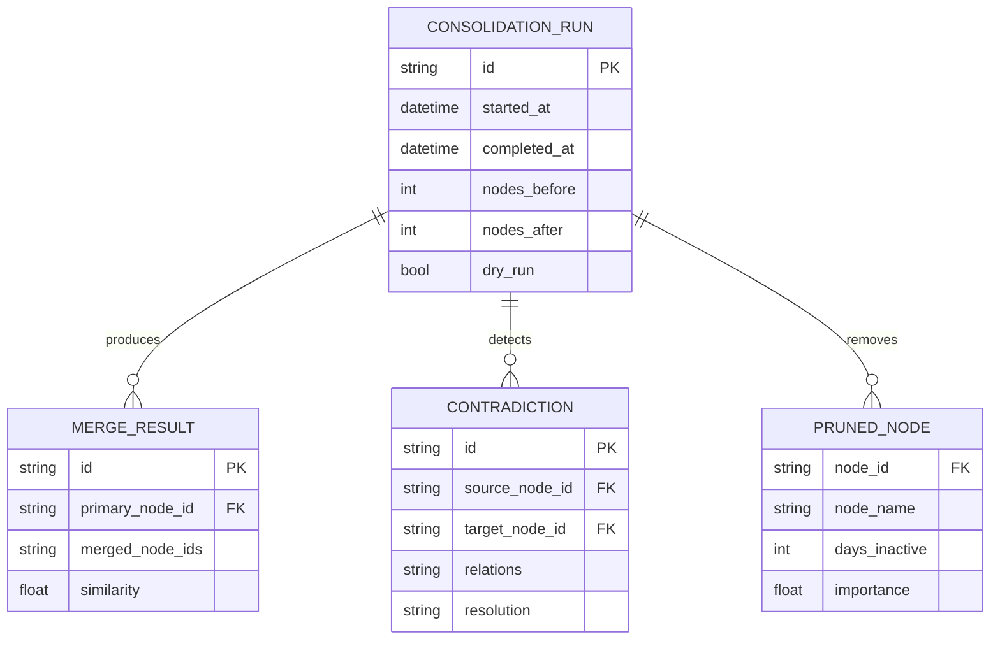

# Phase 3: Memory Consolidation & Local LLM Support

**Version**: 0.3.0
**Status**: Draft
**Created**: 2025-12-08

## Overview

Phase 3 adds two major capabilities to CognitiveOS:

1. **Memory Consolidation ("Sleep" Process)** - Optimize long-term memory by detecting duplicates, resolving contradictions, creating abstractions, and pruning stale memories
2. **Local LLM Support (Ollama)** - Enable offline operation using local Llama models for both entity extraction and response generation

## Problem Statement

### Memory Consolidation
As the knowledge graph grows, it accumulates:
- **Duplicate nodes** with slight variations ("Python", "python", "Python language")
- **Contradictory edges** ("User LIKES Coffee" vs "User DISLIKES Coffee" from different conversations)
- **Fragmented concepts** that could benefit from hierarchical organization
- **Stale memories** that haven't been accessed and have low importance

Without consolidation, semantic search quality degrades and storage grows unbounded.

### Local LLM Support
Current system requires OpenAI API, which:
- Needs internet connectivity
- Incurs per-token costs
- Sends conversation data to external servers

Local LLM support enables offline-first, privacy-preserving operation.

---

## Proposed Solution

### Architecture Changes

```
┌─────────────────────────────────────────────────────────────────────┐
│                         CognitiveOS Phase 3                          │
├─────────────────────────────────────────────────────────────────────┤
│                                                                      │
│  ┌──────────────────┐     ┌──────────────────────────────────────┐  │
│  │   LLM Factory    │────▶│  OpenAI Provider │ Ollama Provider  │  │
│  │  (Swappable)     │     └──────────────────────────────────────┘  │
│  └────────┬─────────┘                                               │
│           │                                                          │
│           ▼                                                          │
│  ┌──────────────────┐     ┌──────────────────────────────────────┐  │
│  │  CognitiveLoop   │────▶│        ExtractionAgent              │  │
│  │                  │     │    (Provider-Agnostic)               │  │
│  └────────┬─────────┘     └──────────────────────────────────────┘  │
│           │                                                          │
│           ▼                                                          │
│  ┌──────────────────┐     ┌──────────────────────────────────────┐  │
│  │   MemoryGraph    │◀───│    ConsolidationEngine               │  │
│  │                  │     │  ┌──────────┬──────────┬─────────┐  │  │
│  └──────────────────┘     │  │Duplicates│Contradict│ Prune   │  │  │
│                           │  │ Merger   │  Detector│ Engine  │  │  │
│                           │  └──────────┴──────────┴─────────┘  │  │
│                           └──────────────────────────────────────┘  │
│                                                                      │
└─────────────────────────────────────────────────────────────────────┘
```

### New Files to Create

| File | Purpose |
|------|---------|
| `src/consolidation/__init__.py` | Package init |
| `src/consolidation/engine.py` | Main ConsolidationEngine class |
| `src/consolidation/run.py` | CLI entry point for consolidation |
| `src/agents/llm_factory.py` | Provider abstraction layer |

### Files to Modify

| File | Changes |
|------|---------|
| `src/config.py` | Add Ollama settings, consolidation config |
| `src/agents/extractor.py` | Use LLM factory instead of hardcoded OpenAI |
| `src/graph_loop.py` | Use LLM factory for response generation |
| `requirements.txt` | Add langchain-ollama, APScheduler |
| `app.py` | Add consolidation UI section |
| `main.py` | Add consolidate command |

---

## Technical Approach

### Part A: Memory Consolidation

#### A1. ConsolidationEngine Class

```python
# src/consolidation/engine.py

class ConsolidationEngine:
    """
    Memory consolidation - like sleep for the AI brain.

    Operations:
    1. Duplicate detection and merging (similarity >= 0.9)
    2. Contradiction detection and resolution
    3. Inactive memory pruning (>30 days, importance <0.3)
    """

    def __init__(self, memory: MemoryGraph):
        self.memory = memory
        self.consolidation_log: List[Dict] = []

    def run_full_consolidation(
        self,
        dry_run: bool = False
    ) -> ConsolidationResult:
        """Run complete consolidation cycle."""
        ...

    def merge_duplicates(
        self,
        threshold: float = 0.9
    ) -> List[MergeResult]:
        """Find and merge duplicate nodes."""
        ...

    def detect_contradictions(self) -> List[Contradiction]:
        """Detect conflicting edges."""
        ...

    def prune_inactive(
        self,
        days_threshold: int = 30,
        importance_threshold: float = 0.3
    ) -> List[str]:
        """Remove stale low-importance nodes."""
        ...
```

#### A2. Duplicate Detection Algorithm

1. Build embedding matrix from all nodes
2. Compute pairwise cosine similarities (O(n²) - optimize with FAISS for large graphs)
3. Find pairs with similarity >= threshold (default 0.9)
4. Group into merge clusters (handle transitive duplicates)
5. Select primary node per cluster (earliest `created_at`)
6. Merge secondary nodes into primary:
   - Sum `access_count`
   - Keep earliest `created_at`, latest `last_accessed`
   - Combine descriptions
   - Regenerate embedding from combined text
   - Redirect all edges from secondary to primary
7. Delete secondary nodes and their orphaned edges

#### A3. Contradiction Detection

Detect opposite relations for same entity pairs:

| Positive | Negative |
|----------|----------|
| LIKES | DISLIKES |
| LOVES | HATES |
| TRUSTS | DISTRUSTS |
| SUPPORTS | OPPOSES |

**Resolution Strategy**: Keep most recent edge, set `validity.end` on older edge (temporal resolution).

#### A4. Pruning Logic

```python
def should_prune(node: Node, days_threshold: int, importance_threshold: float) -> bool:
    days_inactive = (datetime.now() - node.metadata.last_accessed).days
    return (
        days_inactive > days_threshold and
        node.metadata.importance_score < importance_threshold and
        node.label not in PROTECTED_LABELS  # e.g., "User"
    )
```

#### A5. CLI Interface

```bash
# Full consolidation
python -m src.consolidation.run

# Dry-run (preview only)
python -m src.consolidation.run --dry-run

# Custom thresholds
python -m src.consolidation.run --duplicate-threshold 0.85 --prune-days 60
```

---

### Part B: Local LLM Support

#### B1. LLM Factory Pattern

```python
# src/agents/llm_factory.py

from langchain_openai import ChatOpenAI
from langchain_ollama import ChatOllama
from src.config import settings

class LLMFactory:
    """Factory for creating LLM instances based on configuration."""

    @staticmethod
    def create_chat_llm(temperature: float = 0.7):
        """Create LLM for chat/response generation."""
        config = settings()

        if config.llm_provider == "ollama":
            return ChatOllama(
                model=config.ollama_model,
                base_url=config.ollama_base_url,
                temperature=temperature
            )
        else:
            return ChatOpenAI(
                model="gpt-4o",
                api_key=config.openai_api_key,
                temperature=temperature
            )

    @staticmethod
    def create_extraction_llm():
        """Create LLM for entity extraction (structured output)."""
        config = settings()

        if config.llm_provider == "ollama":
            return ChatOllama(
                model=config.ollama_model,
                base_url=config.ollama_base_url,
                temperature=0,
                format="json"
            )
        else:
            return ChatOpenAI(
                model="gpt-4o",
                api_key=config.openai_api_key,
                temperature=0
            )
```

#### B2. Configuration Updates

```python
# src/config.py - New settings

class Settings(BaseSettings):
    # Existing settings...

    # LLM Provider (Phase 3)
    llm_provider: Literal["openai", "ollama"] = Field(
        default="openai",
        validation_alias="LLM_PROVIDER"
    )
    ollama_base_url: str = Field(
        default="http://localhost:11434",
        validation_alias="OLLAMA_BASE_URL"
    )
    ollama_model: str = Field(
        default="llama3.2",
        validation_alias="OLLAMA_MODEL"
    )

    # Consolidation Settings (Phase 3)
    consolidation_enabled: bool = Field(
        default=True,
        validation_alias="CONSOLIDATION_ENABLED"
    )
    duplicate_merge_threshold: float = Field(
        default=0.9,
        validation_alias="DUPLICATE_MERGE_THRESHOLD"
    )
    prune_inactive_days: int = Field(
        default=30,
        validation_alias="PRUNE_INACTIVE_DAYS"
    )
    prune_importance_threshold: float = Field(
        default=0.3,
        validation_alias="PRUNE_IMPORTANCE_THRESHOLD"
    )
```

#### B3. Environment Variables

```bash
# .env additions for Phase 3

# LLM Provider: "openai" or "ollama"
LLM_PROVIDER=openai

# Ollama Configuration (when LLM_PROVIDER=ollama)
OLLAMA_BASE_URL=http://localhost:11434
OLLAMA_MODEL=llama3.2

# Consolidation Settings
CONSOLIDATION_ENABLED=true
DUPLICATE_MERGE_THRESHOLD=0.9
PRUNE_INACTIVE_DAYS=30
PRUNE_IMPORTANCE_THRESHOLD=0.3
```

#### B4. Structured Output with Ollama

langchain-ollama >= 0.2.0 supports structured output natively:

```python
# Updated ExtractionAgent

class ExtractionAgent:
    def __init__(self):
        config = settings()
        base_llm = LLMFactory.create_extraction_llm()

        if config.llm_provider == "ollama":
            # Ollama uses json_mode for structured output
            self.llm = base_llm.with_structured_output(
                EntityExtraction,
                method="json_mode"
            )
        else:
            # OpenAI uses function_calling
            self.llm = base_llm.with_structured_output(
                EntityExtraction,
                method="function_calling"
            )
```

#### B5. Ollama Setup Instructions

```markdown
## Ollama Setup

### Installation

**macOS/Linux:**
```bash
curl -fsSL https://ollama.com/install.sh | sh
```

**Windows:**
Download from https://ollama.com/download

### Download Model

```bash
ollama pull llama3.2
```

### Verify Installation

```bash
ollama list  # Should show llama3.2
```

### Configure CognitiveOS

Edit `.env`:
```bash
LLM_PROVIDER=ollama
OLLAMA_MODEL=llama3.2
```
```

---

## Implementation Phases

### Phase 3.1: LLM Factory (4-6 hours)

1. Create `src/agents/llm_factory.py`
2. Add Ollama settings to `src/config.py`
3. Update `src/agents/extractor.py` to use factory
4. Update `src/graph_loop.py` to use factory
5. Add `langchain-ollama` to `requirements.txt`
6. Test with both providers

### Phase 3.2: Consolidation Engine (12-16 hours)

1. Create `src/consolidation/__init__.py`
2. Implement `ConsolidationEngine` in `src/consolidation/engine.py`:
   - Duplicate detection and merging
   - Contradiction detection
   - Pruning logic
3. Create CLI in `src/consolidation/run.py`
4. Add unit tests for consolidation
5. Test with real memory graphs

### Phase 3.3: Integration (4-6 hours)

1. Add consolidation UI to Streamlit app
2. Add `consolidate` command to CLI
3. Update README with Phase 3 features
4. Update CHANGELOG for v0.3.0

---

## Acceptance Criteria

### Must Have

- [ ] Consolidation detects and merges duplicate nodes (similarity >= 0.9)
- [ ] Contradiction detection flags conflicting edges (LIKES/DISLIKES pairs)
- [ ] Pruning removes inactive nodes (>30 days, importance <0.3)
- [ ] System works offline with Ollama + Llama 3.2
- [ ] CLI command: `python -m src.consolidation.run`
- [ ] Provider switching via `LLM_PROVIDER` environment variable
- [ ] Dry-run mode for consolidation preview

### Should Have

- [ ] Consolidation results summary in Streamlit UI
- [ ] Progress indication for long consolidation runs
- [ ] Ollama auto-detection (verify service is running)
- [ ] Extraction quality parity between OpenAI and Ollama (>80%)

### Nice to Have

- [ ] Background scheduled consolidation (APScheduler)
- [ ] Abstract node creation from clusters
- [ ] Consolidation undo/rollback via backup

---

## Data Model Changes

### New: ConsolidationResult

```python
class ConsolidationResult(BaseModel):
    """Result of a consolidation run."""
    started_at: datetime
    completed_at: datetime
    duplicates_merged: List[MergeResult]
    contradictions_found: List[Contradiction]
    nodes_pruned: List[str]
    total_nodes_before: int
    total_nodes_after: int
    dry_run: bool = False
```

### New: MergeResult

```python
class MergeResult(BaseModel):
    """Result of merging duplicate nodes."""
    primary_id: str
    primary_name: str
    merged_ids: List[str]
    merged_names: List[str]
    similarity: float
```

### New: Contradiction

```python
class Contradiction(BaseModel):
    """Detected contradiction between edges."""
    source_name: str
    target_name: str
    relations: List[str]
    resolution: str  # "kept_recent", "flagged", "user_decision"
```

---

## Risk Analysis

| Risk | Impact | Probability | Mitigation |
|------|--------|-------------|------------|
| O(n²) similarity computation slow | Medium | High (>1k nodes) | Batch processing, consider FAISS |
| Ollama structured output failures | High | Medium | Fallback to OpenAI, retry logic |
| Incorrect duplicate merging | High | Low | High threshold (0.9), dry-run mode |
| Consolidation corrupts data | Critical | Low | Backup before consolidation, transactions |
| Llama extraction quality <80% | Medium | Medium | Prompt tuning, model comparison |

---

## Dependencies

### New Python Packages

```txt
langchain-ollama>=0.2.0  # Ollama integration
```

### External Requirements

- Ollama installed and running (for local LLM mode)
- Llama 3.2 model downloaded (`ollama pull llama3.2`)

---

## Testing Strategy

### Unit Tests

1. `test_consolidation_duplicates.py`:
   - Merge two similar nodes
   - Handle transitive duplicates
   - Edge redirection after merge

2. `test_consolidation_contradictions.py`:
   - Detect LIKES/DISLIKES pairs
   - Temporal resolution

3. `test_consolidation_pruning.py`:
   - Prune inactive nodes
   - Respect importance threshold
   - Protected labels

4. `test_llm_factory.py`:
   - Create OpenAI provider
   - Create Ollama provider
   - Provider switching

### Integration Tests

1. Full consolidation cycle with test graph
2. Entity extraction comparison (OpenAI vs Ollama)
3. End-to-end chat with Ollama provider

---

## ERD: Phase 3 Data Flow



---

## References

- [Ollama Documentation](https://ollama.com/docs)
- [langchain-ollama](https://python.langchain.com/docs/integrations/chat/ollama)
- [Graphiti Knowledge Graph Memory](https://neo4j.com/blog/developer/graphiti-knowledge-graph-memory/)
- [sqlite-vec Documentation](https://github.com/asg017/sqlite-vec)
- [Phase 2 Implementation](./phase-2-sqlite-streamlit.md)

---

## Next Steps

1. **Review this plan** and address any questions
2. **Create feature branch**: `git checkout -b feature/phase-3-consolidation-llm`
3. **Implement Phase 3.1** (LLM Factory) first
4. **Test Ollama integration** before proceeding to consolidation
5. **Implement Phase 3.2** (Consolidation Engine)
6. **Integration and documentation**
7. **Release v0.3.0**
